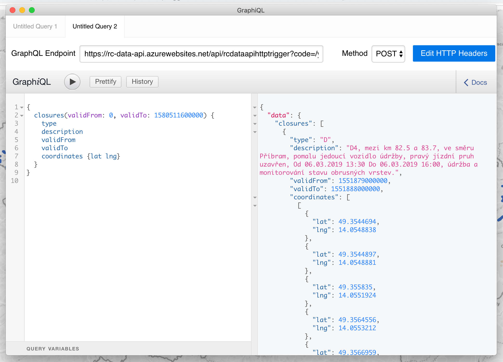
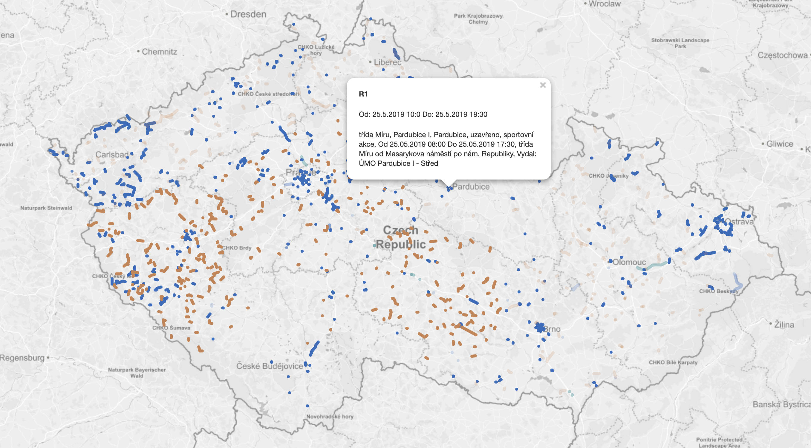

# rc-data-api-azure [REPO BACKUP] 
GraphQL API s daty o uzavírkách na dálnicích a silnicích. Data získává z [RC-ESRIDUMP-AZURE](https://gitlab.com/holly-prototypes/rc-esridump-azure) a každých pár minut je aktualizuje. A stejně jako [RC-ESRIDUMP-AZURE](https://gitlab.com/holly-prototypes/rc-esridump-azure) beží na [Azure Functions](https://docs.microsoft.com/en-us/azure/azure-functions/functions-overview).

## API
API je dostupné na [https://rc-data-api.azurewebsites.net/api/rcdataapihttptrigger?code=/ygS6ekb3RHXwfdjWhK8Gx8qpufme95zsaxNfieYnB9Jaiea3xdCaA==](https://rc-data-api.azurewebsites.net/api/rcdataapihttptrigger?code=/ygS6ekb3RHXwfdjWhK8Gx8qpufme95zsaxNfieYnB9Jaiea3xdCaA==) a k vyzkoušení můžete použí třeba [GraphiQL](https://github.com/graphql/graphiql).

Pro kontrolu dat tu je k dispozici mini web app [RC Data Check](https://rc-data-api.azurewebsites.net/api/rcdataapiwebhttptrigger?code=airuQAwATuTZeGsFVB21ctdReKi2aDfmeKj/YKxWatxtkXRcwxodkw==).

## Jak to je udělané

- [Azure Functions na Node.js](https://docs.microsoft.com/azure/azure-functions/functions-reference-node)
- [TypeScript](https://www.typescriptlang.org)
- [apollo-server-azure-functions](https://github.com/apollographql/apollo-server/tree/master/packages/apollo-server-azure-functions)
- [Leaflet](https://leafletjs.com)
- [Yarn](https://yarnpkg.com/en/)

## Run & Build
Spuštění lokálně:

        yarn start

Build:

        yarn build

Výsledek buildu je ve složce *./dist*

Nasazení na server:

        yarn deploy

## Co ještě není super

- První prequest na nasazenou funkci trvá docela dlouho (asi by to chtělo na azure zapnout něco na způsob warmupu na GAE)
- Logování a procházení logů nasazených funkcí na azure je zatím docela záhada
- Někdy RSD servery nebo [RC-ESRIDUMP-AZURE](https://gitlab.com/holly-prototypes/rc-esridump-azure) vrací podivná data nebo nevrací žádná
- Lokální běh funkce po hotreloadu nechává běžet node instance a celá aplikace pak běžít vícekrát a proto nemáme hotreload zapnutý